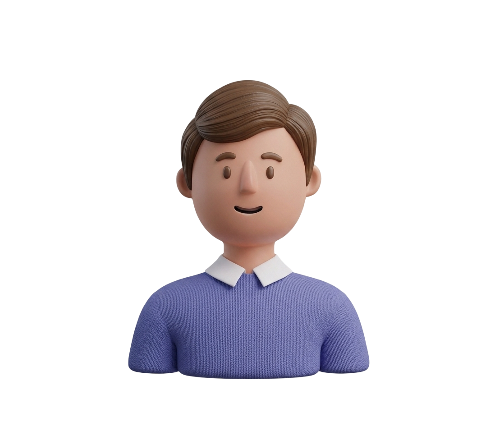

# EduX — Электронный дневник 📚

> Умная веб-платформа для учеников, родителей и учителей. Современный лендинг электронного журнала с анимациями, glassmorphism-дизайном и интерактивным UI.

[](https://developer.mozilla.org/ru/docs/Web/HTML)
[](https://developer.mozilla.org/ru/docs/Web/CSS)
[](https://developer.mozilla.org/ru/docs/Web/JavaScript)
[](https://opensource.org/licenses/MIT)
[](https://github.com/)

---

## ✨ Key Features

-  **🌓 Dark/Light Mode** — бесшовная смена светлой и темной темы с сохранением в `localStorage`.
-  **🎭 Auth Modal** — модальное окно входа с анимацией открытия/закрытия, закрытием по `Escape` и клику на оверлей
- **🃏 3D-тилт карточек** — эффект наклона и блика (`card-glare`) при наведении на новостные и review-карточки
- **📜 Scroll-анимации** — элементы появляются при скролле через `IntersectionObserver` со stagger-задержкой
- **💧 Ripple-эффект** — волновая анимация на всех кнопках при клике
- **🖼 Параллакс hero** — изображение героя скроллится медленнее фона (`translateY`)
- **📍 Активный nav-link** — подсветка текущего раздела в навигации при скролле
- **❓ FAQ-аккордеон** — авто-закрытие предыдущего пункта при открытии нового (`<details>`)
- **📬 Форма обратной связи** — floating-label инпуты с валидацией
- **🎨 Glassmorphism UI** — полупрозрачные карточки с backdrop-filter и градиентами

---

## 🛠 Tech Stack

| Технология | Назначение |
|---|---|
| `HTML5` | Семантическая разметка, секции, `<details>` для FAQ |
| `CSS3` | Glassmorphism, CSS-переменные, анимации, адаптив |
| `JavaScript (ES6+)` | IntersectionObserver, 3D-тилт, ripple, parallax, modal |
| `Google Fonts` | Montserrat + Space Grotesk |

> Без фреймворков и сборщиков — только чистый нативный стек.

---

## 📁 Структура проекта

```
edux/
├── index.html          # Главная страница
├── EDUX.js             # Весь JS-интерактив
├── css/
│   └── style.css       # Стили
└── assets/
    └── images/         # Изображения и иконки
        ├── 1-card.png
        ├── 2-card.png
        ├── 3-card.png
        ├── man2.png
        ├── parent.png
        ├── review-man.png
        ├── avatar.png
        └── ...
```

---

## 🚀 Installation

Проект не требует сборки. Достаточно клонировать и открыть в браузере.

**1. Клонировать репозиторий**
```bash
git clone https://github.com/your-username/edux.git
cd edux
```

**2. Проверить структуру папок**

Убедитесь, что папка `assets/images/` содержит все изображения,
а файл `css/style.css` находится на своём месте.

**3. Открыть проект**

Напрямую через браузер:
```bash
# Вариант 1 — просто открыть файл
open index.html

# Вариант 2 — через Live Server (VS Code Extension)
# ПКМ на index.html → "Open with Live Server"

# Вариант 3 — через Python
python -m http.server 8080
# затем перейти на http://localhost:8080
```

---

## 💡 Usage

После открытия страницы доступны следующие сценарии:

```
1. Нажать кнопку «Войти» → открывается Auth Modal
2. Прокрутить страницу → элементы плавно появляются
3. Навести на карточку новости → 3D-тилт + glare-эффект
4. Перейти в секцию «Поддержка» → заполнить форму или раскрыть FAQ
5. Навигация подсвечивает активный раздел автоматически
```

Пример добавления новой новостной карточки в `index.html`:
```html
<article class="news-card" style="--card-delay: 0.55s">
    <div class="news-card-image">
        
        <div class="news-card-overlay"></div>
    </div>
    <div class="news-card-body">
        <span class="news-tag">Событие</span>
        <h3 class="news-card-title">Заголовок новости</h3>
        <a href="#" class="news-read-more">Читать →</a>
    </div>
    <div class="card-glare" aria-hidden="true"></div>
</article>
```

---

## 🖼 Screenshots / Demo

| Hero | Новости | Отзывы |
|:---:|:---:|:---:|
|  |  |  |

> 📎 _Для просмотра живого демо — откройте `index.html` локально._

---

## 🗺 Roadmap

- [x] Лендинг-страница с glassmorphism-дизайном
- [x] Auth Modal (вход)
- [x] 3D-тилт и glare на карточках
- [x] Scroll-анимации через IntersectionObserver
- [x] FAQ-аккордеон
- [ ] Личный кабинет ученика (в разработке)
- [ ] Личный кабинет учителя (планируется)
- [ ] Мобильное меню (бургер)
- [ ] Счётчики статистики в hero-секции
- [ ] Backend для формы обратной связи

---

## 🤝 Contributing

Вклад в проект приветствуется!

```bash
# 1. Сделайте форк репозитория
# 2. Создайте ветку для фичи
git checkout -b feature/my-feature

# 3. Зафиксируйте изменения
git commit -m "feat: add my feature"

# 4. Отправьте ветку
git push origin feature/my-feature

# 5. Откройте Pull Request
```

Пожалуйста, следуйте соглашению об именовании коммитов: `feat:`, `fix:`, `docs:`, `style:`.

---

## 📄 License

Распространяется под лицензией **MIT**.
Подробнее: [LICENSE](./LICENSE)

---

<div align="center">
  Made with ❤️ for <strong>EduX</strong> — © 2026 ЭлЖур
</div>
